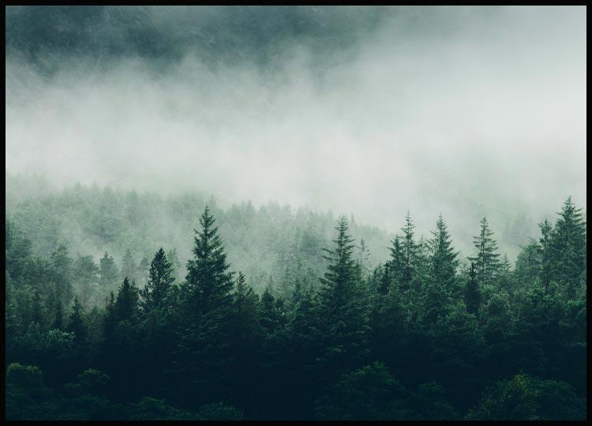

  
  <h1 align="center">Awesome Carbon</h1>
  

    
    
    
    
    
  

  
A curated list of awesome <a href="https://www.popsci.com/environment/what-are-carbon-markets/">carbon</a> crypto-related resources, libraries, tools and more.

  
Please check the <a href="CONTRIBUTING.md">contribution guidelines</a> for information on formatting and writing pull requests.

### Contents

- [Projects](#projects)
- [Podcasts](#podcasts)
- [Articles](#articles)
- [Tools](#tools)
- [Libraries](#libraries)

#### Projects

- [Blockchain For Climate Foundation](https://www.blockchainforclimate.org/) - Putting the Paris Agreement on the Blockchain.
- [CryptoClimateAccord](https://cryptoclimate.org/) - Private sector-led initiative for the entire crypto community focused on decarbonizing the cryptocurrency and blockchain industry.
- [Energy Web](https://www.energyweb.org/) - Deploy digital operating systems for energy grids with a global community of more than 100 energy market participants.
- [Klima DAO](https://www.klimadao.finance/) - Carbon-backed, algorithmic digital currency.
- [Moss.Earth](https://moss.earth/) - Climate tech company, simplifies the offsetting process and guarantees the traceability and transparency of their actions by using blockchain technology.
- [Nori](https://nori.com/) - Transparent, verifiable, and high-quality carbon removal marketplace.
- [Regen Network](https://www.regen.network/) - On-chain registry and marketplace for carbon credits.
- [Single.Earth](https://www.single.earth/) - Marketplace that protects nature by making carbon removal and biodiversity tradable.
- [Toucan](https://toucan.earth/) - Tokenization platform for carbon credits.
- [UPCO2](https://universalcarbon.com/) - Carbon token backed by REDD+ carbon credits.

#### Podcasts

- [Planet of the Klimates](https://klima.fyi/podcast) - The official podcast for KlimaDAO.

#### Articles

- [Verra's statement on crypto](https://verra.org/statement-on-crypto/) - Verra Statement on Crypto Market Activities.

#### Tools

- [carbon.fyi](https://carbon.fyi/) - Calculate carbon emissions of an Ethereum account.
- [Ethereum emissions tracker](https://kylemcdonald.github.io/ethereum-emissions/) by Kyle McDonald
- [Ethereum NFT activity](https://github.com/kylemcdonald/ethereum-nft-activity)

#### Libraries

- [Ethereum emissions calculator](https://github.com/Offsetra/ethereum-emissions-calculator) by Offsetra - Javascript library to calculate carbon emissions of an Ethereum account.

